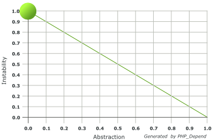
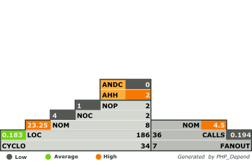

Fluid Views with extended capability
====================================

> Extends the standard Views in Fluid with classes that have additional capabilities.

[](https://travis-ci.org/FluidTYPO3/view)

## Code Quality




_Understanding the [Abstraction Instability Chart](http://pdepend.org/documentation/handbook/reports/abstraction-instability-chart.html)
and [Pyramid Chart](http://pdepend.org/documentation/handbook/reports/overview-pyramid.html)._

## ViewHelper Argument Values

If a ViewHelper instance's arguments' value has not been defined in the Fluid template it is possible to set it through TypoScript.
All you have to know is the class name of the ViewHelper that contains the argument:

```
# Set a default configuration for Fluid's Paginate Widget
plugin.tx_view.viewhelpers.Tx_Fluid_ViewHelpers_Widget_PaginateViewHelper.arguments.defaults.configuration {
	itemsPerPage = 20
	insertBelow = 1
	insertAbove = 0
}

# The same as above, but forcibly overriding any existing argument - example: override all Paginators everywhere
plugin.tx_view.viewhelpers.Tx_Fluid_ViewHelpers_Widget_PaginateViewHelper.arguments.override.configuration { ... }

# Make every VHS Asset of JavaScript type be included as standalone files
plugin.tx_view.viewhelpers.Tx_Vhs_ViewHelpers_Asset_ScriptViewHelper.arguments.override.standalone = 1

# Changing the value of the default "Options" tab title in Flux forms
plugin.tx_view.viewhelpers.Tx_Flux_ViewHelpers_FlexForm_SheetViewHelper.arguments.defaults.label = My default title
```

Beware: the defined *default values* **only apply when the value is not specified**. This means that if the value is specified in
the Fluid template it is not overridden, regardless of being empty or not. Overrides **always override, argument present or not**.

## Template Path Overlays

No more copying of entire folders of templates just to override one single template file. Instead, let EXT:view take care of that
by overriding the default TemplateView and adding a simple capability.

```
plugin.tx_news.view.overlays.myext.partialRootPath = EXT:myext/Resources/Private/Partials/
```

With just one file in the `EXT:myext/Resources/Private/Partials/` path - fx `EXT:myext/Resources/Private/Partials/List/Item.html`
the overridden View now analyzes each overlay path to detect an overlay file for the specific file that is being referenced.

Each of the Partial, Template and Layout root paths can be overlayed individually and overlays can be mixed up. Let's assume
that you want `EXT:foo` to provide a couple of Partials and a Layout for `EXT:news` but want `EXT:bar` to provide a single Partial
template file because that's how you like it. Let's assume `EXT:foo` contains these files:

* EXT:foo/Resources/Private/Partials/Category/Items.html
* EXT:foo/Resources/Private/Layouts/Default.html

And that `EXT:bar` contains this file:

* EXT:bar/Resources/Private/Partials/List/Item.html

Without `EXT:view` it would be impossible to gain access to both these Partials from the same page. But with `EXT:view` it is
possible:

```
plugin.tx_news.view.overlays.foo.partialRootPath = EXT:foo/Resources/Private/Partials/
plugin.tx_news.view.overlays.foo.layoutRootPath = EXT:foo/Resources/Private/Layouts/
plugin.tx_news.view.overlays.bar.partialRootPath = EXT:bar/Resources/Private/Partials/
```

Giving the following behavior in `EXT:view` when the Partial template `Category/Items.html` is requested:

* Tries to find the template in `EXT:bar` because it has added a Partial template path overlay and did so last. The last TypoScript
  to be added takes priority, just as it normally would. _But the template file is not found here so we continue._
* Tries to find the template in `EXT:foo` because it is next. This path has the template file so this file is returned by `EXT:view`

The exact same logic applies to every set of template paths. If requesting a Layout file then only the overlays which have the
`layoutRootPath` setting are considered. If a file is not found, the next overlay is analyzed until finally `EXT:view` defaults
to the old behavior.

## Performance

There is almost zero performance impact from `EXT:view`. The same TypoScript location is used and therefore is alreay available
when rendering, so the only impact from `EXT:view` is:

* Extremely minimal overhead in TypoScript
* Near-zero overhead when loading classes
* Slight (short string-processing and array sorting) overhead per registered overlay that has to be processed

In total the impact is a few megabytes of memory, some additional TS parsing initially and a handful of function calls per overlay.

## Implementing the extended View

Simply install the extension and you are already done. Automagic.

## Supported TYPO3 versions

* 4.5
* 4.6
* 4.7
* 6.0

### Why is this not part of the TYPO3 core extension Fluid or even Flow? I want this in Neos too, you know!

If the core wants it, the core can certainly have it. But I don't want to waste my time arguing first why this should be part of
Flow, then make it for Flow, then backport it and then finally be able to submit what I already made. I spent only three hours
making this and I'll be damned if I should then spend three months battling the TYPO3 contribution hurdle system. With the way
things are I would probably battle all the way until Neos is released. So there you have it.

## Have fun, hope you enjoy!
